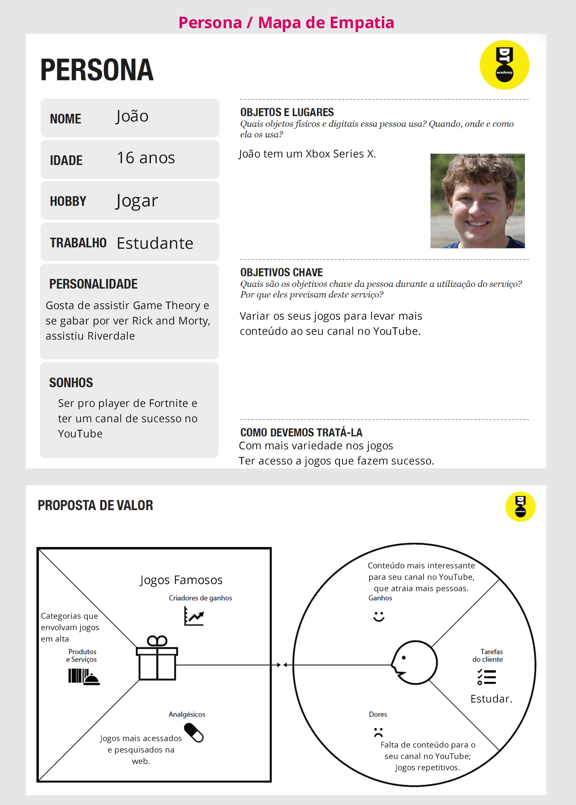
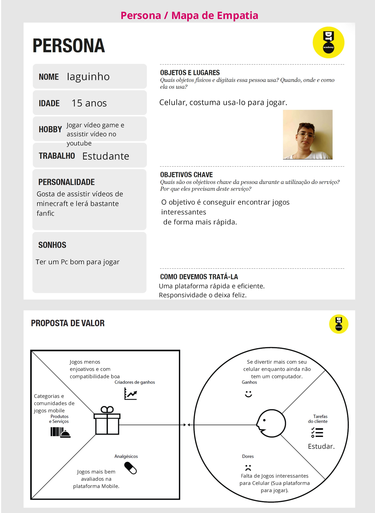
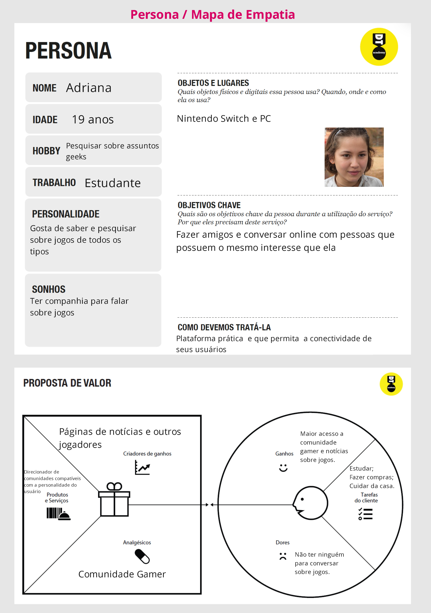
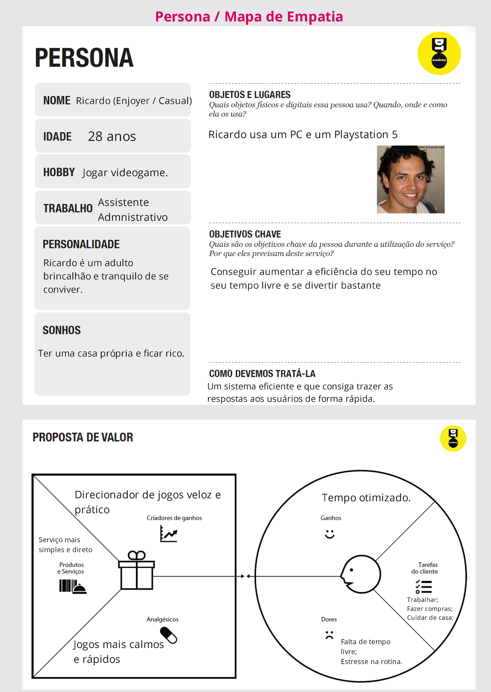
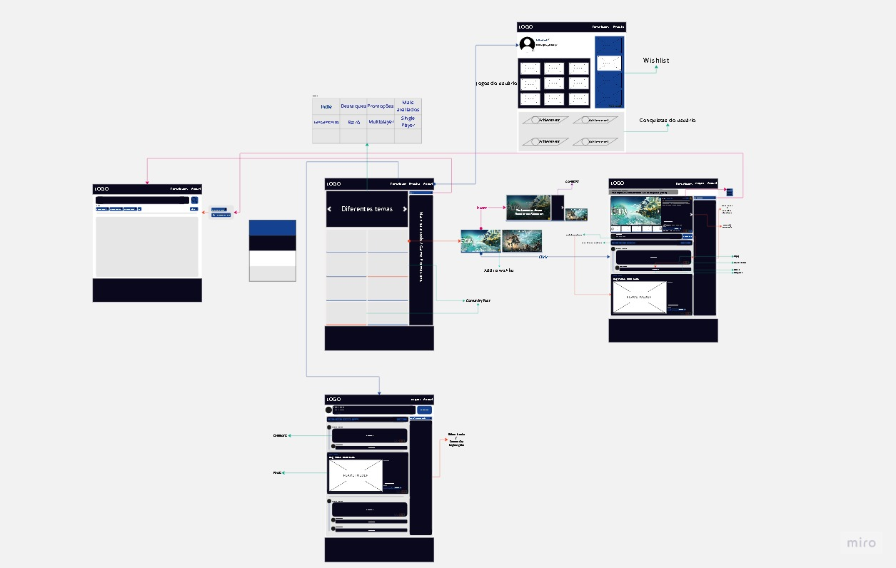
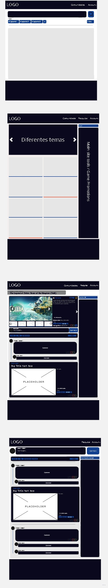

Informações do Projeto
TÍTULO DO PROJETO

Não saber o que jogar

CURSO

1º Período - Ciência da Computação - Campus Coração Eucarístico - PUC Minas

Participantes
- Arthur Clemente Machado
- Danilo Paris Bastos
- Diego Moreira Rocha
- Gabriel Cunha Schlegel 
- Iago Fereguetti Ribeiro
- Pedro Augusto de Paula Ferreira dos Santos Souza

Estrutura do Documento

Informações do Projeto

Participantes

Estrutura do Documento

Introdução

Problema

Objetivos

Justificativa

Público-Alvo

Especificações do Projeto

Personas, Empatia e Proposta de Valor

Histórias de Usuários

Requisitos

Requisitos Funcionais

Requisitos não Funcionais

Restrições

Projeto de Interface

User Flow

Wireframes

Metodologia

Divisão de Papéis

Ferramentas

Controle de Versão

############## SPRINT 1 ACABA AQUI #############

Projeto da Solução

Tecnologias Utilizadas

Arquitetura da solução

Avaliação da Aplicação

Plano de Testes

Ferramentas de Testes (Opcional)

Registros de Testes

Referências

Introdução
  
Problema

  Problemas sobre achar de forma dinâmica e fácil um jogo de interesse do usuário, para assim otimizar o tempo e aumentar a gama de conhecimento entre os jogos diponíveis. Normalmente pessoas que gostam de jogos digitais sofrem dessa dor. O contexto se passa em um ambiente virtual. 
  
Objetivos

   Desenvolver um software para solucionar o problema da complexidade de achar um jogo interessante para jogar. Dentro deste objetivo, destacam-se a meta de se criar um ambiente intuitivo, onde achar jogos seja algo simples e prático e interativo, onde os usuários se conectem em comunidades específicas para deixar a dinâmica mais eficiente como um todo.

Justificativa

  A motivação do grupo para trabalhar com essa problemática envolve primeiramente a paixão dos membros por jogar e o fato da dificuldade para encontrar jogos sejam um problema de nossas vidas também. Também envolve uma análise, tanto pela nossa experiência quanto pelas entrevistas, que aponta o quão abrangente podem ser os mecanismos de filtragem do gêneros de jogos e o quão importante é a união das comunidades para que a procura de jogos seja mais direcionada e interativa. 

Público-Alvo

  O público-alvo do nosso software é essencialmente os usuários de jogos. Tais indivíduos envolvem pessoas que jogam ou tem a intenção de começar a adentrar ao mundo dos games. Podem abranger pessoas de todas as idades, estado-civil e formação. Nosso software além disso, terá um enfoque também, nos indivíduos apaixonados por jogar, que possuem uma rotina apertada e um poder de compra limitado. 

Especificações do Projeto

  Nessa parte do documento teremos uma visão mais técnica do nosso projeto. As informações serão trazidas dos nosso grupos de interação entre membros, da plataforma “Miro”, na qual organizamos nossas ideias e prioridades e do conteúdo retirado das entrevistas que fizemos com possíveis clientes do nosso software. 

Personas, Empatia e Proposta de Valor

  As personas que foram entrevistadas e auxiliaram no direcionamento do projeto estão listadas abaixo:

 

Histórias de Usuários
Eu como amante de jogos...
Quero/preciso de jogos novos para jogar...
Para me divertir.

Eu como usuário do sistema...
Quero/preciso comunidades e jogos diversos...
Para entrar no mundo dos jogos.

Requisitos

As tabelas que se seguem apresentam os requisitos funcionais e não funcionais que detalham o escopo do projeto.

Requisitos Funcionais

RF-001 Sistema de Recomendação por Bolhas BAIXA

RF-002 Chat Privado entre Usuários BAIXA

RF-003 Notificação de Promoção na Lista de Desejos BAIXA

RF-004 Lista de Desejos MEDIA

RF-005 Página de Pesquisa MEDIA

RF-006 Exposição de Jogos Indie ALTA

RF-007 Chat de Comunidade ALTA

RF-008 Histórico de Preços BAIXA

RF-009 Recomendação de Fácil Acesso Nichada MEDIA

RF-010 Filtragem Específica ALTA

RF-011 Classificação Nichada ALTA

RF-012 Página de Usuário BAIXA

RF-013 Página de Comunidade MEDIA

RF-014 Página Individual do Jogo ALTA

RF-015 Página Principal ALTA 

Requisitos não Funcionais

RNF-001 O sistema deve ser responsivo ALTA

RNF-002 O sistema deve possuir um banco de dados eficaz ALTA 

Restrições

O projeto está restrito pelos itens apresentados na tabela a seguir.

ID	Restrição

01	O projeto deverá ser entregue até o final do semestre

02	Não pode ser desenvolvido um módulo de backend

Projeto de Interface

O nosso projeto de Interface consiste em uma tela principal, com informações iniciais sobre os produtos de maior importância do momento. Uma tela de usuário, com informações do usuário e uma lista de desejos, para das destaque fácil aos itens de maior interesse do usuário. Páginas próprias de cada jogo, com informaçoes das suas devidas comunidades e etc. E por fim uma página de pesquisa, feita para buscar os jogos que o usuário esteja procurando. Em todas as abas projetamos um sistema de fácil entendimento para e fácil manuseio do cliente. 

User Flow

Wireframes

Metodologia

  O grupo se iniciou com papel e caneta. Listamos quais eram nossas dúvidas, certezas e suposições sobre a problemática. Em seguida, desenvolvemos nosso Mapa de Stakeholders aonde categorizamos as Pessoas Fundamentais, Importantes e Influenciadoras do projeto (respectivamente).
  
  O próximo passo foi entrevistar possíveis usuários para o projeto. Nossos entrevistados foram conhecidos (pelo qual fizemos entrevistas online pelas plataformas do Discord e do Whatsapp) e colegas do Curso de Ciência da Computação. Em seguida, fizemos um processo de Entrevista Qualitativa, aonde selecionamos uma entrevista considerada produtiva e fizemos uma análise aprofundada, listando o que nos surpreendeu e o que pudemos aprender e priorizar pelas falas do entrevistado.
  
  Através dessas noções que obtivemos, pudemos criar seis personas, que iriam simbolizar futuros usuários do nosso software com diferentes objetivos, sonhos, problemas e características.
  
  Portanto, chegou a hora de partir para as soluções. Cada membro do grupo, através da plataforma Miro, apresentou uma ideia para tornar nosso software um produto de qualidade. Tais ideias, nós categorizamos em diferentes prioridades baseadas em custo por impacto. Ou seja, analisamos cada ideia para entender qual era seu custo (alto ou baixo) e seu impacto no produto final (alto ou baixo).
  
  Por fim, para finalizar nossa primeira Sprint, desenvolvemos um wireframe do site. Assim, tivemos uma visão mais prática e dinâmica de como iremos tornar cada ideia uma realidade.

Divisão de Papéis

  Diego Moreira e Danilo Paris – Relatório Técnico
  
  Arthur Clemente e Iago Fereguetti – Apresentação do Projeto
  
  Pedro Augusto e Gabriel Schlegel – Wireframe do Projeto 

Ferramentas

As ferramentas utilizadas pelo grupo para produzir os arquivos para o projeto foram: 

Ambiente	Plataforma	Link de Acesso

Processo de Design Thinkgin	Miro	https://miro.com/app/board/uXjVMY8ZlDI=/

Repositório de código	GitHub	https://github.com/ICEI-PUC-Minas-PMGCC-TI/ti-1-pmg-cc-t-20231-grupo-de-nao-saber-o-que-jogar

Wireframe e User Flow https://miro.com/app/board/uXjVMSkcCGk=/

As ferramentas empregadas no projeto são:

Editor de código.
Ferramentas de comunicação
Ferramentas de diagramação
Plataforma de hospedagem
O editor de código foi escolhido porque ele possui uma integração com o sistema de versão. As ferramentas de comunicação utilizadas possuem integração semelhante e por isso foram selecionadas. Por fim, para criar diagramas utilizamos essa ferramenta por melhor captar as necessidades da nossa solução.

Links Úteis - Hospedagem:

Getting Started with Heroku
Crie seu Site com o HostGator
GoDady
GitHub Pages

Controle de Versão

Nosso grupo não utilizou nenhum controle de versão.

############## SPRINT 1 ACABA AQUI #############

Projeto da Solução

Um site de filtragem de jogos e comunidades.

Tecnologias Utilizadas

Utilizamos as linguagens: HTML, CSS e JavaScript.

Utilizamos o Miro e Canva.

Utlizamos LocalStorage e JSON.

  O usuário armazena os dados JSON no LocalStorage e os dados são retornados, tanto para fazer o cadastro e login, quanto para criar um post.

Descreva aqui qual(is) tecnologias você vai usar para resolver o seu problema, ou seja, implementar a sua solução. Liste todas as tecnologias envolvidas, linguagens a serem utilizadas, serviços web, frameworks, bibliotecas, IDEs de desenvolvimento, e ferramentas. Apresente também uma figura explicando como as tecnologias estão relacionadas ou como uma interação do usuário com o sistema vai ser conduzida, por onde ela passa até retornar uma resposta ao usuário.

Inclua os diagramas de User Flow, esboços criados pelo grupo (stoyboards), além dos protótipos de telas (wireframes). Descreva cada item textualmente comentando e complementando o que está apresentado nas imagens.

Arquitetura da solução

Inclua um diagrama da solução e descreva os módulos e as tecnologias que fazem parte da solução. Discorra sobre o diagrama.

Exemplo do diagrama de Arquitetura:

Exemplo de Arquitetura

Avaliação da Aplicação

  O cenário de teste utlizado foi a própria avaliação por pares. Foi bem útil para visualizarmos o projeto em geral.

Plano de Testes

  Todos os testes realizados foram positivos, os feedbacks foram 90% muito bons, apenas algumas observações a serem analisadas.

Registros de Testes

 Houveram muitos erros com CSS e JavaScript, assim acessamos diversos sites para resolver os problemas, e resolvemos.

Referências

[StackOverflow](https://stackoverflow.com)
https://www.w3schools.com
